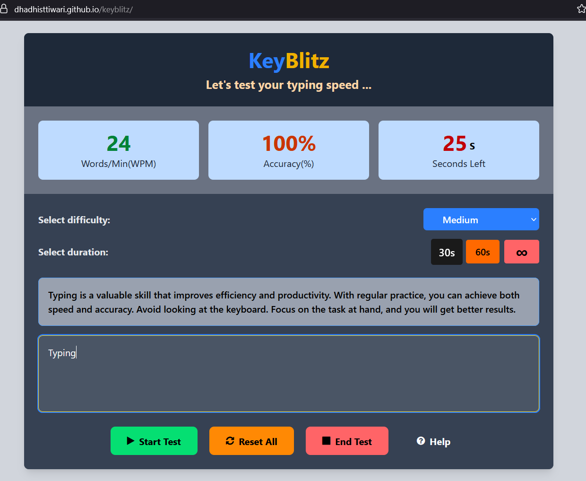

# ⚡ KeyBlitz - Typing Speed Test App

**KeyBlitz** is a fast, interactive, and responsive typing speed test app built using **React + Vite**. Designed to challenge and improve your typing speed and accuracy, it offers multiple difficulty levels, time-based or infinite mode, and live performance tracking.

---

## 🚀 Features

- 🎯 **Difficulty Levels** – Easy, Medium, Hard typing challenges
- ⏱️ **Duration Options** – 30s, 60s, or Infinite mode
- 💬 **Real-time WPM and Accuracy Calculation**
- 📊 **Live Typing Stats** – WPM, Accuracy, and Remaining Time
- 🎨 **Responsive UI** – Built with Tailwind CSS
- 💡 **Help & Typing Tips Section**
- ♻️ **Reset, End, and Help Controls**
- 🔥 **React + Vite** with fast refresh and ESLint integration

---

## 🔗 Live Demo

👉 [Play the Game](https://https://dhadhisttiwari.github.io/keyblitz//)

---

## 🛠️ Tech Stack

- ⚛️ React (with Hooks and Refs)
- ⚡ Vite (Fast dev environment)
- 💨 Tailwind CSS (Utility-first styling)
- ✅ ESLint (Code quality and consistency)
- 🎨 Font Awesome (UI Icons)

---
## 📸 Preview



---
## 📦 Getting Started

```bash
# Clone the repo
git clone https://github.com/DhadhistTiwari/keyblitz.git
cd keyblitz

# Install dependencies
npm install

# Start the dev server
npm run dev
